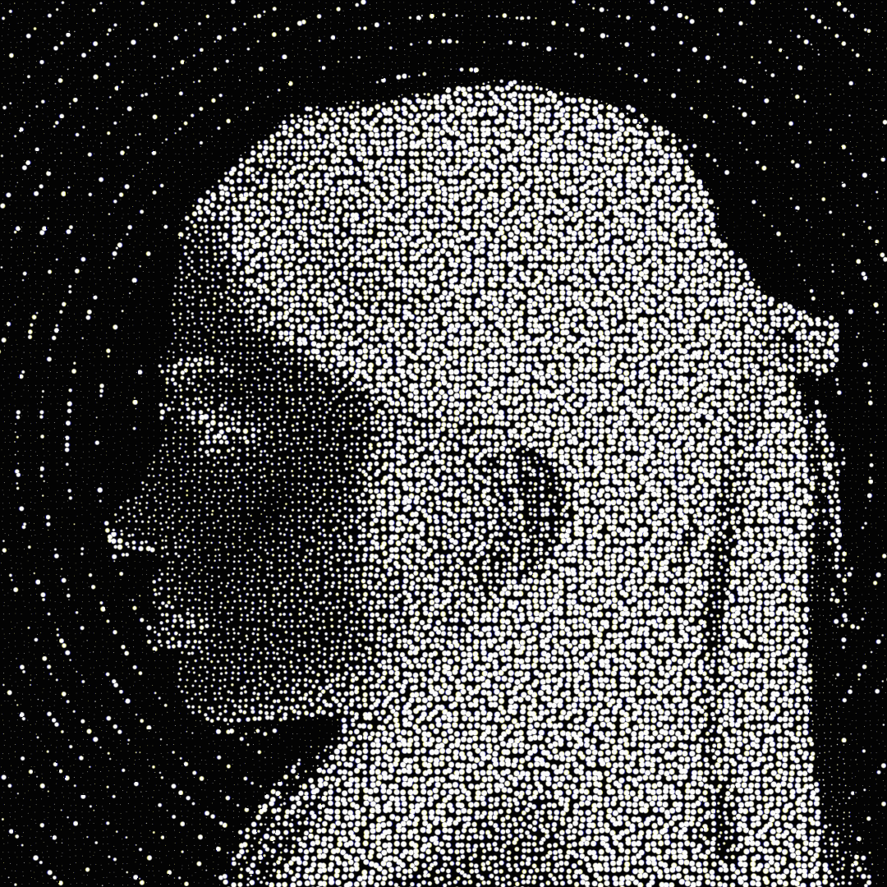

<p align="center">
  
</p>

<h1 align="center">Oizys</h1>

An open userspace driver for the DisplayLink Ridge dock. It presents two 1920×1080
displays to macOS, captures them, and encodes the result as Ridge colour strips over USB
without loading DisplayLink Manager, vendor libraries, or firmware.

The driver, encoder, transport and recovery supervisor are C. Swift is the glue and
nothing more: it binds ScreenCaptureKit, `CGVirtualDisplay` and the menu-bar app, and hands
every frame straight to C, which owns queueing, buffer lifetimes, pixel access, encoding
and all scheduling decisions. The portable debug launcher in `Tools/PortableDebug.m` uses
Objective-C. The driver does not use Objective-C++.

Both panels have been confirmed rendering a live desktop on the hardware below, and the
login service brings them up on its own across a restart. The wire-format corrections that
took it there are in [Protocol.md](Documentation/Protocol.md); how they were found is in
[Dock-Trace.md](Documentation/Dock-Trace.md).

> Oizys is still experimental, and one habit is worth keeping: a successful build, a USB
> acknowledgement and a clean log prove nothing about the glass. Every fault found here
> passed all three. Confirm both monitors after installing and after a cold dock reconnect.

<p align="center">
  <a href="Documentation/Architecture.md">Architecture</a> ·
  <a href="Documentation/Protocol.md">Protocol</a> ·
  <a href="Documentation/Dock-Trace.md">Dock trace</a> ·
  <a href="Documentation/Routing.md">Routing</a> ·
  <a href="Documentation/Ports.md">Ports</a> ·
  <a href="Documentation/Calibration.md">Calibration</a> ·
  <a href="Documentation/Testing.md">Testing</a> ·
  <a href="Documentation/Performance-2026-08-30.md">Performance</a> ·
  <a href="Documentation/Xcode.md">Xcode</a> ·
  <a href="CONTRIBUTING.md">Contributing</a>
</p>

## Overview

<table>
<tr><td width="120"><strong>Dock</strong></td><td>ACASIS DS-0602 (DL-6950), USB <code>17e9:6000</code></td></tr>
<tr><td><strong>Identity</strong></td><td>type-<code>0x40</code> configuration record names <code>RidgeDoc</code></td></tr>
<tr><td><strong>Heads</strong></td><td>two Dell P2219H, logical selectors <code>1</code> and <code>3</code></td></tr>
<tr><td><strong>Video</strong></td><td>endpoints <code>0x08</code> and <code>0x0b</code></td></tr>
<tr><td><strong>Mode</strong></td><td>1920×1080 at 60 Hz, authenticated over HDCP 2.2</td></tr>
</table>

A run authenticates the dock, sets both heads, creates two virtual displays, and captures
them with ScreenCaptureKit. The first frame after a mode set is a keyframe covering the
whole strip grid, presented three times so it reaches every buffer the dock rotates through.
After that only the macro tiles whose pixels moved are encoded, each riding three consecutive
frames for the same reason. A still desktop puts zero bytes on the video endpoints; the
link is held up by the control session's own clocks, a 13 ms status poll and a 3 s
heartbeat, which run whether or not anything moved.

## Requirements

macOS 14 or later on Apple silicon, Xcode 16 or later, and Screen Recording permission for
the built binary. The encoder is NEON and is compiled for the host core.

## Installing a release

Tagged builds are published from `.github/workflows/release.yml`.

| File | What it is |
| --- | --- |
| `Oizys-<version>.dmg` | production app; drag to Applications |
| `Oizys-debug-<version>.dmg` | portable diagnostic; installs nothing, owns the dock only while it runs |
| ZIP / PKG + `SHA256SUMS.txt` | the same builds, for scripted installs |

Launch the production app once so macOS can ask for Screen Recording. The driver captures
the desktop to send it over USB and cannot drive a panel without it.

Those bundles are signed ad hoc. macOS will refuse them on a machine other than the one
that built them without an explicit Gatekeeper override, and they are not notarized, so
treat a release as something to build from source rather than hand to someone else.

## Building and installing

From a fresh clone, one command prepares everything a build needs:

```bash
./dev.sh setup                        # developer tools, Python environment, Xcode project
```

It checks for Xcode and says exactly what to run if it is missing, creates `.venv` and
installs the test dependencies, installs the optional fixture tools through Homebrew when
Homebrew is present, and generates `Oizys.xcodeproj`. It is safe to re-run: every step is
skipped once satisfied. `./dev.sh setup --check` reports what is missing and installs
nothing.

Run `./dev.sh` for the interactive developer menu, or use its scriptable commands:

```bash
./dev.sh install production           # optimized app, CLI and login startup
./dev.sh build production-fallback    # optional vendor fallback; not installed
./dev.sh build debug-minimal          # single portable developer executable
./dev.sh debug                        # build and open debug beside production
./dev.sh build-debug-all              # build all three portable debug variants
./dev.sh xcode                        # regenerate and open the native Xcode project
```

Installation replaces other Oizys apps in `/Applications` and `~/Applications` with
`/Applications/Oizys.app`, preserves settings, and installs `oizys` in a writable command
directory on PATH when available. Debug is never installed. Its executable is
`dist/Oizys-debug-<version>-<variant>`; the version comes from `VERSION`.

### Screen Recording after an install

macOS keys Screen Recording to a code-signing identity, and an ad-hoc build gets a new one
every rebuild. The old approval outlives the bundle it belonged to, so System Settings shows
Oizys already ticked while every preflight fails — and the login agent starts, refuses, exits,
and is respawned ten seconds later, forever.

So installing clears Oizys's own approval and asks for a fresh one: the app's dialog first,
then the Screen Recording pane, and it waits at a terminal until the box is ticked. Only
`org.oizys.*` identifiers are touched, nothing is ever granted by script, and the running
service still never goes near TCC.

```bash
python3 Tools/install_app.py <bundle> --keep-permissions   # leave the approval alone
python3 Tools/install_app.py <bundle> --no-prompt          # report what is missing, ask nothing
```

The login agent's stderr goes to `~/Library/Application Support/Oizys/logs/service.log`,
truncated on each install. If the desk stays dark, that file says why in one line.

The developer menu also covers cleaning, dependency setup, tests, coverage, three
sanitizers, encoder and GUI profiling, static analysis, Xcode archives, status and privacy
settings. Builds do not run tests. See [Xcode workflows](Documentation/Xcode.md) for IDE
details.

### Looking at the interface without hardware

```bash
./dev.sh ui          # render every menu panel to PNG and open them
./dev.sh overlay     # draw the display-connect ripple once, on the main display
```

`ui` renders the popover, each window section, the status-item glyph on both menu-bar grounds,
and three frames of the connect animation, from a fixed model. It needs no dock, no driver and
no screen, so it runs in a review or in CI. Several layout faults in this app were found that
way and none of them would have shown up in a build log.

### Debug beside production

A debug executable carries its signed runtime bundle and extracts it into
`~/Library/Caches/Oizys/Portable/`. Opening the GUI leaves production running.
**Start debug driver** pauses production and takes the dock; **Stop debug and restore
production** returns it. Hardware diagnostics use the same handoff. Only one debug
session can own the dock, but idle developer windows and software tests can coexist.

It does not install a login item. A crashed portable GUI is recovered by its launcher;
a direct Xcode debug session that crashes can be recovered with `oizys service recover-debug`.
Debug settings, logs and embedded tools stay under
`~/Library/Application Support/Oizys/Debug/<variant>/`. They do not change production
settings.

`./dev.sh debug` uses the current checkout and its shared `.venv`; portable executables
launched separately use embedded source tools unless you choose a checkout. **Prepare
tools** installs their isolated Python dependencies. Launching the GUI does not start
tests or video playback.

Repeat `./dev.sh debug debug-verbose` after edits to close the previous verbose debug
session, rebuild, and run the new version. Active tests in that session stop first;
production resumes if debug had taken the dock. Nothing is installed, and the command
does not reset permissions.

### Capture lifetime

Grant **Oizys** Screen Recording access if macOS asks. Login startup never waits for
permission dialogs. A small event listener remains resident without USB polling while
the dock is absent; capture, encoding, virtual displays and USB workers are stopped.
Capture starts only for one supported dock in an awake, logged-in console session and
stops on unplug, sleep or session deactivation. Reconnection still requires hardware
initialization. No application can guarantee zero RAM use or eliminate macOS login delays.

### Signing and Screen Recording

Production uses C `-O3`, Swift `-O`, link-time optimization, dead stripping and hardened
runtime. It excludes the developer GUI and diagnostic commands. `production-fallback`
adds vendor recovery and replaces the same production app if installed. Both use the
same bundle identifier for privacy identity.

Local builds are signed ad hoc; a changed signature may require macOS permission again.
Developer ID signing and notarization are still required for frictionless distribution to
other Macs. `OIZYS_SIGN_IDENTITY` selects a signing identity for `dev.sh`; no script
grants privacy permissions or disables Gatekeeper.

When a debug app lacks Screen Recording access, it clears registered debug Screen
Recording permissions before requesting its own approval. Production and other apps
are never reset. A valid debug approval is kept; repeated clicks do not reset it again
within the same process. The app's Quit command restores production and removes its
own debug permission entry, so a later session may need approval again. Use the system
Quit & Reopen button during permission setup to preserve that pending grant. Another
running copy of the same debug variant keeps its shared permission until it quits.
Ad-hoc rebuilds can also require approval; an Apple Development signing identity keeps
the signing requirement stable across edits.

### Icons and packages

The artwork lives in `Assets/`, one file per job. `Assets/Logo.png` is the repository logo,
every app icon size and the panel header; `Assets/tiny_Logo.png` is the menu-bar item and the
terminal art, and nothing else is cut from it. Both are bundled under the same names they have
in the repository. Xcode packaging uses macOS `sips` and `iconutil` to build the icon sizes,
and the full-resolution PNG is copied into the bundle as well.

The menu-bar item cannot be the picture scaled down. A menu-bar icon is a template: macOS
discards the colour and tints whatever is opaque, so a stipple portrait on an opaque black
ground arrives as a solid block. `Logo.template` rebuilds alpha from luminance instead, so the
bright grain becomes opaque and the ground becomes transparent, and the artwork survives at
18 points in a light or dark menu bar.

Replace the PNG and rebuild to update all of it; run `.venv/bin/python Tools/ascii_logo.py`
to regenerate the terminal art in `Sources/oizys/logo.h`.

Production ZIP and PKG packaging remain available through
`Tools/build_app.py --format both`; use `dev.sh install` to register per-user startup.

## The menu bar

Every variant installs a menu-bar item — one item, including in a diagnostic build, where the
debug session's controls hang off the same item's right-click menu. Clicking it opens a panel
with the driver's state, the displays it can see, and switches for starting at login and for
the connect animation. The panel is placed against the screen the item is drawn on and closes
as soon as anything else takes focus. Right-clicking gives a plain menu instead, for when a
panel is the wrong shape for the job.

**Open Oizys…** opens the full window, which is organised as:

| Section | What is there |
| --- | --- |
| Displays | every display, with brightness and mirroring |
| Power & standby | per-monitor keep-awake and blank-when-idle, the macOS timer, and idle frame rate |
| Sidecar | the iPad's state and arrangement, connect and disconnect, and the power reality |
| Colour | match the monitors to each other using an iPhone, over a QR code |
| USB ports | `oizys ports` in the window, with any downgraded link called out |
| All settings | every driver setting, editable, showing which differ from their defaults |
| How it works | a live diagram of the path a pixel takes, drawn from what is attached now |

When a display comes online, Oizys draws a short ripple on that display and nothing else: a
non-activating, click-through overlay that closes itself after under two seconds. It never
takes focus and never appears twice for one event. The switch for it is in the panel, next to
a Preview button for trying it without unplugging anything.

### Brightness on a dock-driven monitor

DDC/CI reaches a monitor over its own I2C channel, which exists only on a real display pipe.
A head driven over the dock has no such pipe, so its monitor cannot be asked to dim itself and
`oizys ddc list` says so. Implementing DDC/CI as a tunnel through the dock's control session
is possible, because the dock already speaks I2C to read EDID.

The protocol half of that tunnel is built and tested: `Sources/OizysCore/ddc_tunnel.c` frames
MCCS messages, computes and validates the checksums, parses replies, rejects an answer about
the wrong feature, and retries the way the standard requires. What it does not have is the
dock's opcode for "perform this I2C transaction" — the EDID command carries a DDC selector
and no address field, so the generic transaction is a different message and its id is not
published anywhere this project may look. `oizys_ddc_tunnel_install` takes that transport as
a function pointer, and until one is installed `oizys_ddc_tunnel_available()` is zero and the
menu says DDC is unreachable on a dock head rather than offering a button that does nothing.

What works instead is upstream of the problem. Oizys encodes every pixel those panels
receive, so brightness for a head is a gain applied during encoding:

```bash
oizys config set head.left.brightness 70
```

The menu bar has the same control as a halftone slider. It dims the picture, not the
backlight, and it only darkens: driving above unity clips highlights rather than matching
them. A change repaints the head, because the cached strips were encoded at the old gain.

Settings are re-read by a running driver within a second, so this and most other keys take
effect without a restart.

### When a monitor keeps going to standby

Two different clocks put a panel to sleep, and they fail differently. macOS has one
display-sleep timer covering every screen, so if both monitors sleep together at the same
interval, that is the one to change — Power & standby links to it.

A monitor also sleeps on its own when its input stops changing, and every model has its own
patience. Panels sleeping at *different* times — one after four minutes, one straight away —
is this, not macOS. An idle desktop puts zero bytes on the video endpoint by design, so a
panel can decide nothing is arriving.

Both controls are per head, because the problem is:

```bash
oizys config set head.left.keepalive_s 30    # repaint every 30s so this panel never sleeps
oizys config set head.right.standby_min 4    # let this one go black after 4 minutes still
```

`keepalive_s` repaints the cached image, which costs no capture and no encoding because the
strips are already encoded. `standby_min` blanks the head instead of tearing it down: a
deactivated head stops being a display and moves every window on it, while black pixels leave
the display in place, so the next frame wakes it and the layout never moved.

### Power saving

`power.saving` lowers the capture rate to `power.idle_fps` once every active head has been
still for `power.idle_after_s`. Capture, encoding and USB all scale with frame rate and a
still desktop has nothing to send at any rate, so this costs nothing and the first change
restores full speed. On by default.

### When the main display gets smaller

macOS stores a resolution against each *set* of attached screens, not against each screen.
Plugging the dock in makes a set it has not seen before, so it falls back to a smaller scaled
mode for the built-in panel; the layout Oizys writes afterwards is permanent, which is what
turns a one-off into a resolution that stays wrong. A 14" or 15" laptop typically drops one
scaling step, and the desktop really is smaller — not just the diagram in System Settings.

Oizys records every screen's origin *and* mode before it creates a head, and puts both back.
That is `display.keep_modes`, on by default:

```bash
oizys config set display.keep_modes false   # let macOS pick, and keep what it picks
```

A resolution you set yourself is not undone. The heads arriving and a person choosing a
resolution look identical to the window server, so the two are told apart by when they
happen: a mode that moves within five seconds of a screen appearing or leaving is treated as
fallout and reverted, and one that moves at any other time is adopted as the new intent.

### Sidecar

An iPad can be attached from Oizys directly — the Sidecar panel lists what is reachable — and
Oizys can attach it on its own when it turns up:

```bash
oizys config set sidecar.auto_connect true
oizys config set sidecar.device "shib's iPad Pro"   # empty means whichever is offered first
oizys config set sidecar.require_desk false         # connect anywhere, not only at a desk
```

Nothing polls. SidecarCore pushes into the menu-bar app when the reachable set changes, and
the run loop stays parked until it does. `sidecar.require_desk` is the difference between a
docked Mac and one on a sofa: on AC with another screen attached, the iPad earns a place as a
second display, and otherwise it is somebody's iPad. Disconnecting by hand is respected —
Oizys leaves it alone for five minutes rather than taking the display straight back — and
five failed attempts stand it down for half an hour.

macOS ships no public interface for connecting Sidecar, so this drives a private Apple
framework and can stop working after any update. When it does, the panel says so instead of
offering a button that does nothing; everything else about an attached iPad goes through the
ordinary display APIs and is unaffected.

## Terminal controls

Running `oizys` with no arguments opens a full-screen terminal UI on the alternate screen,
so it leaves the scrollback alone. The left column carries the logo, the live service state
and every attached display; the right column is a menu over an output pane. Below 92
columns the logo column drops and the menu takes the full width. The older numbered menu
is still there as `oizys tui --menu`.

| Key | Action |
| --- | --- |
| arrows or `j`/`k` | move |
| Return | run |
| `PgUp` / `PgDn` | scroll the output |
| `r` | refresh |
| `q` | quit |

The ASCII art is generated from `Assets/tiny_Logo.png` by `Tools/ascii_logo.py`, which writes
`Sources/oizys/logo.h`. Point it at another image to change it.

Every variant includes the same CLI. With production installed, run `oizys` or `oizys tui`.
A portable debug executable accepts `--cli tui` or any CLI command without opening the GUI.
The production app executable also accepts `--cli`.

```bash
oizys monitors                         # current monitors, pixels, desktop size and mode Hz
oizys monitor 1 modes                  # replace 1 with an ID from monitors
oizys monitor 1 mode 3                 # select a listed mode index
oizys monitor 1 position 1920 0        # session arrangement, in desktop points
oizys monitor 1 mirror off
oizys ddc get 0x10 --display 1         # brightness on a supported native DDC connection
oizys ports                            # every USB device's negotiated vs declared link speed
oizys calibrate show                   # stored colour correction, per head
oizys calibrate run <readings.json>    # fit and store a captured session
oizys calibrate clear                  # back to uncorrected
oizys config list
oizys config set capture.fps 60
oizys service restart                  # apply changed driver settings
oizys service stop                     # stop until resumed or the next login
oizys service login-disable            # stop and disable automatic startup
oizys service login-enable
```

The TUI exposes these controls, all driver configuration keys, brightness, contrast,
volume, input selection and power through DDC. DDC is unavailable on connections that do
not expose a supported native I2C path, including Oizys's virtual dock heads. Display mode
Hz is not a measurement of physical panel output or capture FPS. Unsupported changes
report errors rather than silently pretending to succeed.

## Running

```bash
build/Release/oizys probe                      # identify the hub, read-only
build/Release/oizys routes                     # configured routes and native I2C matches, read-only
build/Release/oizys diagnose --takeover        # authenticate both heads, read EDIDs
build/Release/oizys verify --takeover          # measured pattern proof
build/Release/oizys run --takeover --stats     # one diagnostic session with capture metrics
build/Release/oizys serve --takeover --stats   # recover Oizys sessions after failures
build/Release/oizys confirm                    # record that you saw both panels
```

`--takeover` stops DisplayLink Manager before claiming the USB interfaces; bounded commands
restore it when they finish and `run` restores it on Ctrl-C. `serve` owns a separate C
worker, restarts Oizys after faults, and waits for a disconnected dock to return. It does
not launch DisplayLink for recovery. On Stop it restores DisplayLink only if it was running
before takeover. Virtual displays are recreated during recovery, so applications may move
windows during that gap.

## Dock and native routing

Both Dell HDMI connections currently use the Ridge USB graphics path. Disabling one with
`heads.active` stops Oizys driving that output. It does not connect it to the Mac's GPU.
`heads.native` describes an intended native connection and cannot switch the dock's wiring.
An explicit native configuration is checked before `run`, `patterns`, or `verify` stops
DisplayLink Manager. Overlapping dock/native selections and unverified native connections
are rejected.

A hybrid setup needs a physical native route through USB-C DisplayPort Alt Mode or
Thunderbolt. A dock can provide that alongside DisplayLink only if it has the additional
hardware. The identified ACASIS adapter advertises both HDMI outputs through DisplayLink,
with no separate native output. See [the routing investigation](Documentation/Routing.md).

`oizys ddc list` reports native I2C services matched to a unique online monitor EDID.
DDC reads and writes over this backend still need validation on a natively connected
monitor. Ridge USB DDC tunnelling is not implemented. The Swift app currently provides
connection, recovery status, permission guidance and diagnostics; it does not yet expose
monitor settings.

## Verification

`verify` and `run` write `logs/verify.json`: the live USB owner, Ridge identity and
firmware, H-prime/L-prime/V-prime results, sealed control replies, both presence bits and
EDIDs, and video writes on both endpoints.

`machine_pass` covers what the process can observe. `overall_pass` additionally requires a
person and is set only by `oizys confirm`, which refuses a run whose `machine_pass` is
already false. The separation is deliberate: nothing measurable here distinguishes a
faithfully encoded black frame from a broken encoder, and earlier versions of this driver
reported success from USB acknowledgements while one panel was black and the other showed
no signal.

Both Dells were confirmed on 2026-08-29. A later reconnect failure was recorded on
2026-08-31, followed by head-addressing fixes. Those historical observations are not
acceptance results for a newly built app. See the [dock trace investigation](Documentation/Dock-Trace.md).

## Testing

```bash
python3 Tools/test.py                    # build the library, run every suite
python3 Tools/test.py --coverage         # native and Python reports, no hardware takeover
python3 Tools/test.py --coverage --project-coverage-floor 100  # strict target; currently fails
python3 Tools/test.py --sanitize thread
python3 Tools/test.py --mutate
```

The suite is Python driving `libOizysCore.dylib` through ctypes, so it exercises the
shipping code rather than a reimplementation of it. `Tools/test.py` creates `.venv` and
installs pytest, hypothesis and numpy on first run. Coverage additionally installs
`coverage.py`. The whole project does not have 100% coverage; see the measured scopes and
remaining gaps in [Testing.md](Documentation/Testing.md).

`Tests/Support/reference.py` is a second implementation of the codec, written in numpy from
the format rather than from the C. Any surface can be run through both, so unlike a
recorded vector it says something about inputs nobody thought to record. Mutation testing
scores 100% on `wht.c` against it: no single-operator change to the encoder survives,
because any behavioural change makes the two disagree.

## Profiling

`run --takeover --stats` reports capture cadence, pending-frame replacements, processing
time and capture timestamp age when USB submission finishes. These do not measure panel
latency. `--profile` additionally instruments the inner codec loops and has measurable
overhead; do not use it for a CPU comparison against the vendor.

Frame PNG/binary dumps are off by default. Set `capture.dump_frames` only for an explicit
diagnostic capture: files in `logs/` can contain private screen content, including failure
dumps. Normal operation does not write pixel dumps.

```bash
python3 Tools/profile.py
python3 Tools/profile.py --save baseline.json
python3 Tools/profile.py --compare baseline.json
```

Zone collection is in C, because the zones are tens of nanoseconds and a Python callback
would cost more than the work being measured. Attribution, presentation and baseline
comparison are in Python.

```bash
build/MotionBench 60 --pattern cycle        # workload: every screen, above every window
python3 Tools/measure_processes.py cpu.json --seconds 20
python3 Tools/report.py logs/<run>          # one README.md with tables and charts
```

`report.py` reads driver logs, process samples and saved profiles out of a folder and
writes a single `README.md` beside them: latency per head against the frame budget, strips
sent against the strips a whole surface would be, zone timings, CPU and RSS, and the
failure lines grouped by shape with a count. `MotionBench` is the workload it is usually
reading; `--pattern` chooses which stage to pressurise, from scrolling rules through dense
text, full-screen noise, a panning gradient, 10 Hz flashes and scattered blinking squares
to a still desktop.

## Performance

See [the hardware comparison and recovery report](Documentation/Performance-2026-08-30.md)
for the current motion workload, CPU/RSS measurements, and physical-test status. The table
below is an earlier encoder microbenchmark, not an end-to-end latency measurement.

Earlier measurements used a 1920×1080 desktop with cursor and window damage:

| stage | at the start | now |
| --- | --- | --- |
| fingerprint a surface | 33.7 ms | 0.21 ms |
| encode a full frame, one core | 31.8 ms | 15.2 ms |
| encode a full frame, all cores | — | 2.8 ms |
| encode one macro tile | 0.236 ms | 0.068 ms |

Four things account for that. Strips are independent, so `dispatch_apply` spreads them over
the cores, which was worth more than every other change combined. Fingerprinting uses the
CRC32 instruction, one word per cycle against three dependent operations for the hash it
replaced. The colour conversion and the quantiser are NEON. The bit writer holds a register
and stores whole words rather than ORing single bits into pre-zeroed buffers.

The encoder is written as NEON intrinsics rather than inline assembly, and the generated
code is the argument for that: the widening subtract in the colour conversion comes out as
a single `usubl.8h`, fusing three intrinsics the source asks for separately. Hand-written
assembly would have frozen the worse version and locked the register allocator out.

There is no Metal in the scanout path, measured rather than assumed. Fingerprinting is the
most GPU-shaped work in the driver — 8 MB in, 16 KB out, unified memory, no upload cost —
and on an M3 it takes 0.21 ms across the cores. The same job as a compute kernel takes
0.863 ms, and an empty dispatch round trip costs 0.129 ms before any work happens. The
encoder is a worse fit again: variable-length bit packing whose output the CPU needs
straight back.

## Repository

```text
Configs/            xcconfig build settings
Documentation/      architecture, protocol and testing notes
Sources/OizysCore/  the driver
Sources/oizys/      command-line entry point and C supervisor
Sources/OizysApp/   native Swift menu-bar app
Tests/              pytest suites and the numpy reference model
Tools/              build, test, profile, packaging and mutation scripts
```

`Tools/make_dmg.py` builds the disk images, `Tools/ascii_logo.py` regenerates the terminal
artwork, and `Tools/test.py` is what `./dev.sh test` runs.

## Contributing

See [CONTRIBUTING.md](CONTRIBUTING.md) for validation, hardware acceptance, privacy, and
release requirements. Do not publish raw screen dumps or device-identifying logs.

## License

MIT. See [LICENSE](LICENSE).
